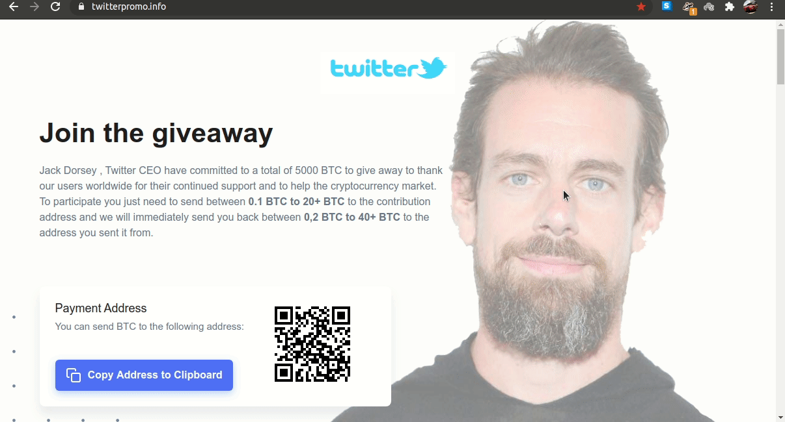
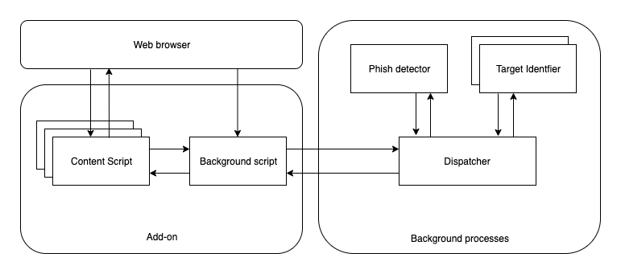

# off-the-hook-plus


An efficient and usable client-side cross platform compatible phishing prevention application.



## module architecture



## thesis

If you really feel the urge to read the detailed thesis that was submitted, click [here](thesis/bethesis.pdf), which I highly recommend you not to do.

## folder structure explained

```brainfuck
off-the-hook-plus
├── code
│   ├── addon                   <---chrome extensions
│   │   ├── background script
│   │   └── content script
│   ├── phish detection         <---safe or phish
│   └── target identification   <---most similar site
├── contents                    <---fyp submit data
│   ├── done
│   ├── notdone
│   └── teamlist                <---2020 passouts
├── documentation
│   └── (n)th review            <---total 3 reviews
│       ├── doc
│       └── pdf
├── images
│   ├── image
│   │   ├── drawio              <---import in drawio
│   │   └── png
│   └── screenshots
├── mail these                  <---mail before review
│   └── (n)th review
│       ├── ppt
│       ├── pdf
│       └── zip
├── papers                      <---ieee only
│   ├── literature survey       <---base for base     
│   │   └──surveys
│   └── pdf                     <---base
├── presentation                <---total 3 reviews
│   └── (n)th review
│       ├── pptx
│       └── pdf
├── samples                     <---samples
├── thesis                      <---latex nightmare
├──LICENCE
└──README.md
```

## install off-the-hook-plus on your machine

### prerequisites
1. [XAMPP](https://www.apachefriends.org/index.html) for hosting the php files.
2. [Google Chrome](https://www.google.com/intl/en_in/chrome/) for serving the extension.
3. [Anaconda](https://www.anaconda.com/) as it is easier to install python and conda this way.

### installation
1. Run the following in the shell to create the python environment, activate it and install the python packages needed for off-the-hook-plus.
```console
$conda create --name fyp python=2.7 
$conda activate fyp
$conda install -c anaconda joblib
$conda install -c anaconda beautifulsoup4
$conda install -c auto python-whois
$conda install -c conda-forge googlesearch
$conda install -c anaconda numpy
$conda install -c anaconda scikit-learn
$conda install -c anaconda requests
$conda install -c anaconda lxml
```
2. In the following php files, do the changes.
   * code/phish detector/clientServer.php
   * code/phish detector/updatewhitelist.php
   1. Replace all instances of `/home/sbenstewart/anaconda3/envs/fyp/bin/python` with the output from the shell command `which python`. Use "Find and replace". It's a lot easier.
   2. Replace all instances of `/mnt/neverdelete/projects/fyp/code/phish\ detector/whitelistadder.py` with the output from the shell command `pwd | sed 's/ /\\ /g'`.
   3. Copy paste these files into your `htdocs` folder.
3. Change the `http://localhost` in the code/add on/content script/popup.js as needed by the XAMPP config.
4. Open Google Chrome. Navigate to More Tools->Extensions. Make sure that the "Developer Mode" on the top right corner is on.
5. Click "Load unpacked" button and open the folder /code/add on/background script.
6. Repeat step 5 for the folder /code/add on/content script.
7. Congratulate yourself for installing off-the-hook-plus. To check the webpages, click the `content script` extension.

## road map
* Use python http client to remove dependency on php.
* Fix plain text whitelist.
* Use custom tree datastructure instead of files for whitelist.
* Make python installable package.

## contributing on off-the-hook-plus
To contribute on off-the-hook-plus, follow these steps:

1. Fork this repository.
2. Create a branch: `git checkout -b <user_name>`.
3. Make your changes and commit them: `git commit -m '<commit_message>'`
4. Push to the original branch: `git push origin <project_name>/<location>`
5. Create the pull request.

Before contirbuting, beware that you might be summoned before the panel to explain the pull request, with docs and decks.


## legal stuff

All the content which includes the code, the documentation and the decks are under an [MIT License](/LICENSE). Click on them to read in detail about what they mean and how you can use them.

[](https://opensource.org/licenses/MIT)

## acknowledgements
Down here I would like to acknowledge all those who made off-the-hook-plus possible.

* My awesome team mates [N.Dhanush](https://github.com/SimplyMrD) and [G.Santhosh](https://github.com/gsanthosh98) without whom it would not have been such fun doing a final year project.
* [Dr. Angelin Gladston](mailto:angel@cs.annauniv.edu) for guiding off-the-hook-plus to it's completion. 
* [The panel from the Department of Computer Science and Engineering, CEG](http://cs.annauniv.edu/people/teaching.php) who gave meaningful inputs to make off-the-hook-plus better.
* [Google Docs and Slides](https://docs.google.com) for making the team collaboration a lot easier.
* [Drawio Chrome App](https://chrome.google.com/webstore/detail/diagramsnet-desktop/pebppomjfocnoigkeepgbmcifnnlndla?hl=en-GB) that made it possible to easily render the images.
* [LaTeX](https://en.wikipedia.org/wiki/LaTeX) for making it way harder to submit off-the-hook-plus as a thesis.

## contact

If you want to contact me you can reach me at <sbenstewart@gmail.com>.

<h3>have a great day :)</h3>


